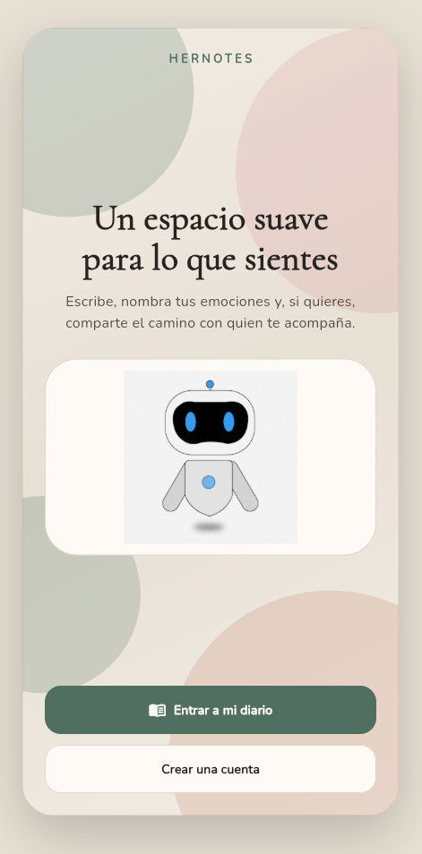
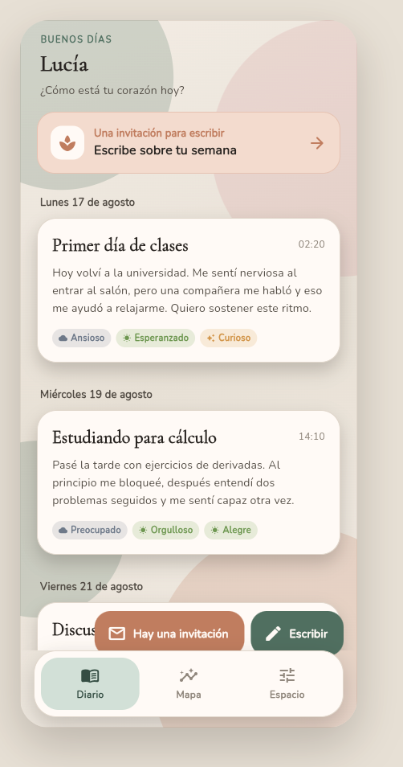
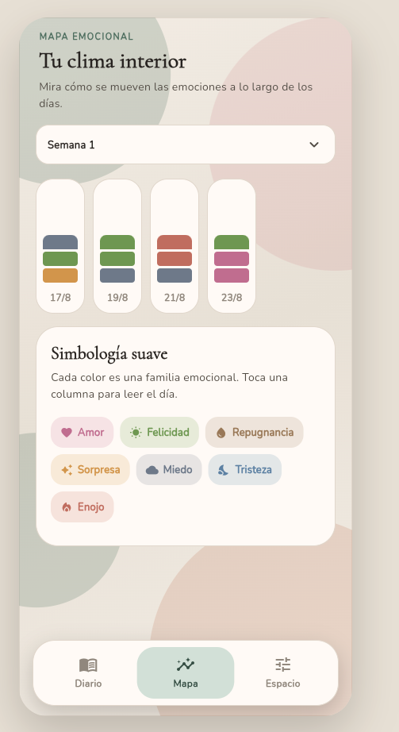
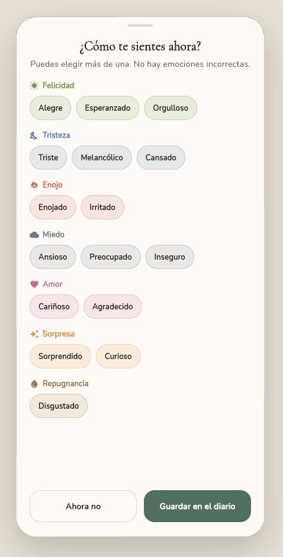
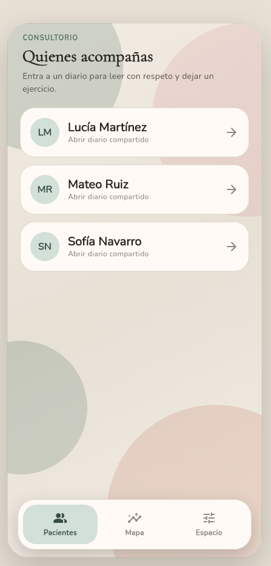
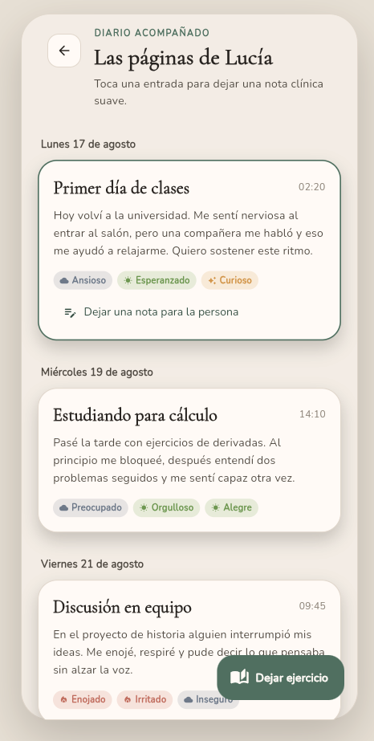
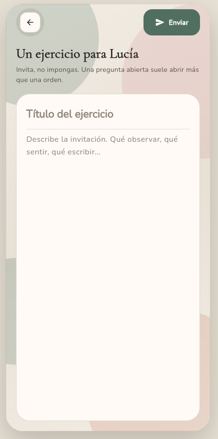
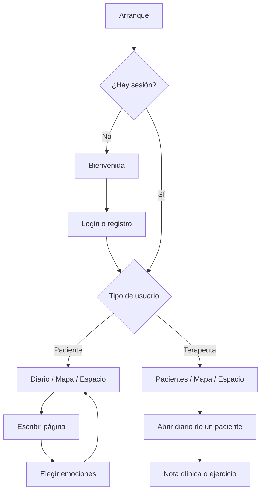

# HerNotes

Diario terapéutico en Flutter para nombrar emociones y, si se desea, compartir el camino con un terapeuta. El espacio está pensado para sentirse suave: lino, salvia y copy que invita, no exige.

## Capturas


<table>
  <tr>
    <td align="center" width="33%">
      
      <br /><sub>Bienvenida</sub>
    </td>
    <td align="center" width="33%">
      
      <br /><sub>Diario del paciente</sub>
    </td>
    <td align="center" width="33%">
      
      <br /><sub>Mapa emocional</sub>
    </td>
  </tr>
  <tr>
    <td align="center">
      
      <br /><sub>Nombrar emociones</sub>
    </td>
    <td align="center">
      
      <br /><sub>Consultorio</sub>
    </td>
    <td align="center">
      
      <br /><sub>Diario acompañado</sub>
    </td>
  </tr>
  <tr>
    <td align="center">
      
      <br /><sub>Dejar un ejercicio</sub>
    </td>
    <td></td>
    <td></td>
  </tr>
</table>

## Qué hace la app

HerNotes tiene dos roles con el mismo diario como centro:

| Rol | Para quién | Qué puede hacer |
| --- | --- | --- |
| **Paciente** | Quien escribe | Llevar un diario, etiquetar emociones, ver su mapa emocional, responder ejercicios y vincularse con un terapeuta |
| **Terapeuta** | Quien acompaña | Ver pacientes, leer diarios compartidos, dejar notas clínicas suaves y asignar ejercicios de escritura |

### Funcionalidades

- **Bienvenida y cuentas.** Entrar al diario o crear cuenta eligiendo rol (paciente o terapeuta).
- **Diario.** Páginas agrupadas por día, con título, texto y chips de emoción. El paciente escribe; el terapeuta lee y puede dejar una nota sobre una entrada.
- **Ejercicios.** El terapeuta invita a escribir. El paciente ve un aviso suave (“Hay una invitación”) y responde desde el diario.
- **Emociones.** Al guardar una página se eligen una o varias emociones, agrupadas por familia: amor, felicidad, tristeza, enojo, miedo, sorpresa, repugnancia.
- **Mapa emocional.** Columnas por día y semana. Cada color es una familia emocional; al tocar un día se lee la página.
- **Vínculo terapéutico.** El terapeuta comparte un código; el paciente lo ingresa en Espacio.
- **Espacio.** Perfil, modo noche, recordatorios (próximamente) y cerrar sesión.
- **Demo.** Cuentas de prueba para recorrer ambos roles sin backend.

## Cómo funciona



1. `main.dart` inicializa Firebase, storage local, tema y providers.
2. `GuiaView` mira si hay usuario en `LocalStorage`. Si no, muestra la bienvenida.
3. Tras el login, `SetterView` carga al paciente o al terapeuta y abre `MainShell`.
4. El shell usa navegación inferior (tres pestañas) y `IndexedStack` para no perder el estado.
5. Cada pantalla pide datos a un `Provider`; el provider llama a un *service* de Data.
6. `http_client.dart` decide si la petición va a Azure o al `MockStore` in-memory.

Las pantallas de escribir, emociones, ejercicios y notas clínicas se abren encima del shell (ruta apilada), con botón de volver.

## Arquitectura

El código sigue una separación en tres capas más configuración:

```text
Pantalla  →  Provider  →  Service  →  HTTP client  →  Azure o MockStore
                ↑
             Models (Domain)
```

| Capa | Carpeta | Responsabilidad |
| --- | --- | --- |
| **Presentation** | `lib/Presentation/` | UI, navegación, estado de pantalla (Provider) |
| **Domain** | `lib/Domain/` | Modelos: nota, emoción, usuario, tarea, login |
| **Data** | `lib/Data/` | Services, cliente HTTP, mocks y credenciales de demo |
| **Config** | `lib/Config/` | Tema, paleta, API, validaciones e ilustraciones de marca |

**Por qué así.** Las pantallas no hablan con la red. Los providers orquestan. Los services construyen URLs y parsean JSON. El cliente HTTP es el único que sabe si estamos en demo o en Azure (`useMocks` en `lib/Config/api_config.dart`).

Estado global con **Provider**:

- `UserProvider` — sesión, login, registro, logout
- `NotesProvider` — notas, tareas, anotaciones
- `EmotionProvider` — catálogo y selección de emociones
- `DoctorProvider` / `PacienteProvider` — perfil y vínculo
- `ThemeProvider` — modo claro / noche
- `NotificationsProvider` — token de avisos

## Organización de carpetas

```text
lib/
├── main.dart                 # Arranque, MultiProvider, MaterialApp
├── firebase_options.dart
├── Images/                   # Capturas de la app (este README)
├── Config/
│   ├── api_config.dart       # URL de Azure y bandera useMocks
│   ├── theme/                # Paleta y ThemeData
│   ├── utils/                # Tema persistido, colores de emoción, email
│   └── images/               # GIF, SVG e iconos de marca
├── Domain/
│   └── models/               # Entidades de negocio
├── Data/
│   ├── http_client.dart      # Enruta a mock o red
│   ├── services/             # Auth, notas, doctor, paciente, emociones
│   └── mocks/                # Store in-memory y credenciales demo
└── Presentation/
    ├── guia.dart             # ¿Sesión o bienvenida?
    ├── setterView.dart       # Carga paciente o terapeuta
    ├── screens/              # Una pantalla por archivo
    ├── widgets/              # Botones, diario, nav, atmósfera…
    └── provider/             # ChangeNotifiers
```

**Pantallas principales**

| Archivo | Qué muestra |
| --- | --- |
| `begginScreen.dart` | Bienvenida |
| `loginScreen.dart` / `registerScreen.dart` / `singUpScreen.dart` | Entrar y crear cuenta |
| `main_shell.dart` | Navegación inferior |
| `diaryScreen.dart` | Diario (paciente o vista del terapeuta) |
| `noteScreen.dart` | Escribir una página + emociones |
| `progressScreen.dart` | Mapa emocional |
| `listOfUsersScreen.dart` | Pacientes del terapeuta |
| `newTaskScreen.dart` | Crear un ejercicio |
| `anotationsScreen.dart` | Nota clínica sobre una entrada |
| `settingsScreen.dart` | Espacio: tema, vínculo, salir |

También hay `android/`, `ios/`, `web/`, `macos/` y `firebase.json` para empaquetar y publicar en Firebase Hosting (`build/web`).

## Demo

Con mocks activos (`lib/Config/api_config.dart`):

| Rol | Correo | Contraseña |
| --- | --- | --- |
| Paciente (Lucía) | `lucia.martinez@hernotes.com` | `Alumno123` |
| Terapeuta (Carlos) | `carlos.hernandez@hernotes.com` | `Profesor123` |

Código de vinculación de demo: `PROF-2024`.

En el login también hay atajos **Soy paciente** y **Soy terapeuta**.

## Cómo correrla

Flutter **3.47.1** (FVM: `.fvmrc`).

```bash
fvm use
flutter pub get
flutter run
```

Build web (el que usa Firebase Hosting):

```bash
flutter build web --release --no-wasm-dry-run
```

La salida queda en `build/web`.

```bash
flutter test
```
